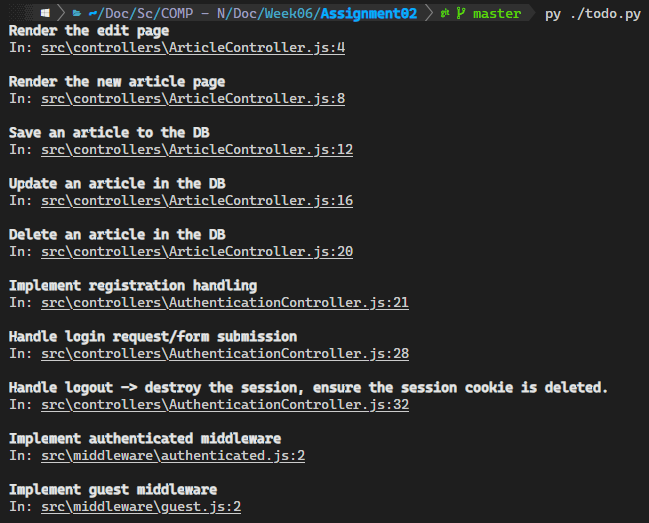

# Helper Scripts for COMP3012 Course

## [todo.py](./todo.py)
### Description
Searches for all `@todo` and `TODO` comments in the `.` and `src` directories and displays them along with vscode clickable links to file and line number.

*__Note:__* Place into root of Lab/Assignment to run.

### Usage
```bash
py todo.py
```


## [mongodb-service.py](./mongodb-service.py)
### Description
Setup and run `mongod` as a service on windows (does not install `mongod` just handles the service).

*__Note:__* Requires admin permission, will attempt to elevate if not launched with insignificant permissions.

### Usage
```
mongodb-service.py

SERVICE_NAME:   MongoDB
DB_PATH:        C:\mongodb\db
LOG_PATH:       C:\mongodb\log.txt

usage: mongodb-service.py [-h] (--install | --remove | --start | --stop)

optional arguments:
  -h, --help  show this help message and exit

Action:
  --install   install a service for MongoDB
  --remove    remove MongoDB service
  --start     start MongoDB service
  --stop      stop MongoDB service

```


